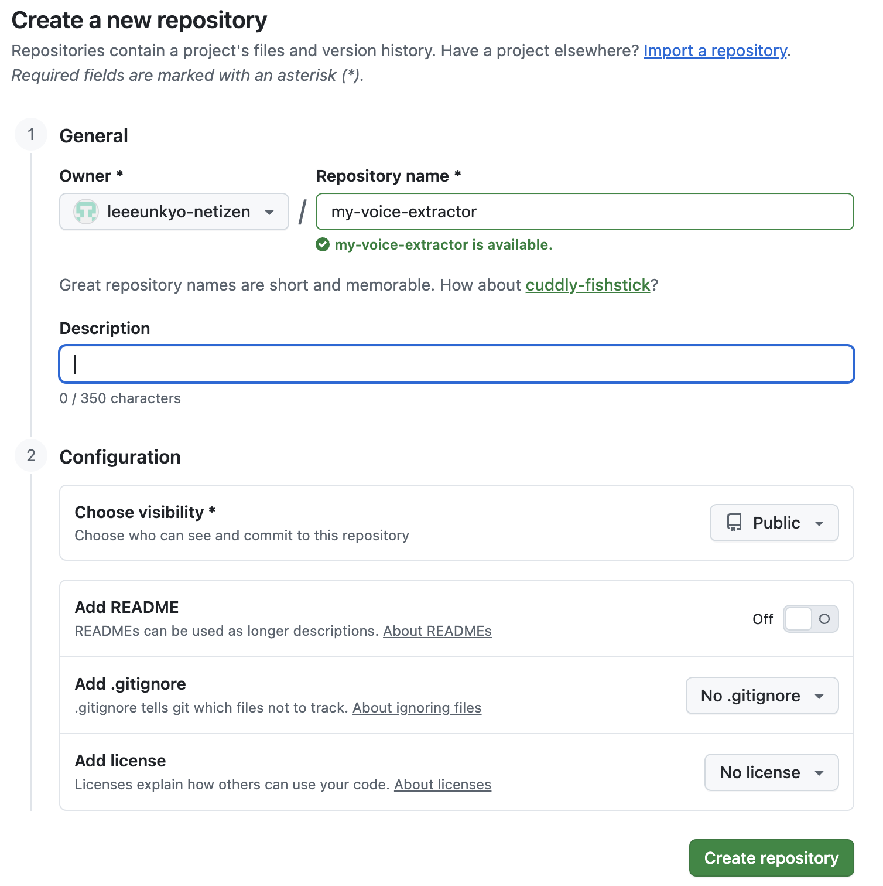

# my-voice-extractor

영상에서 목소리만 깔끔하게 뽑아내고 싶은 한국 크리에이터를 위한 보컬 추출 워크스페이스입니다.

인터뷰 영상, 유튜브 콘텐츠, 쇼츠 원본, 강의 녹화본처럼 배경음과 목소리가 섞여 있는 소스에서 `목소리만 따로` 정리해 다음 작업으로 넘기기 쉽게 만드는 데 초점을 맞췄습니다.


## 한눈에 보기

- 로컬 영상 파일에서 바로 목소리 추출
- 유튜브 같은 영상 URL을 넣으면 다운로드부터 분리까지 자동 처리
- 진행 상황을 실시간으로 확인 가능
- 한국 사용자가 바로 이해하기 쉬운 단순한 작업 흐름

## 이런 분께 잘 맞아요

- 인터뷰 영상에서 사람 목소리만 따로 정리하고 싶은 분
- 릴스, 쇼츠, 유튜브 편집 전에 음성 소스를 먼저 분리하고 싶은 분
- 강의, 브이로그, 후기 영상에서 내레이션만 따고 싶은 분
- 복잡한 오디오 툴보다 가볍고 빠른 로컬 워크플로우가 필요한 분

## 데모 자리

실제 앱 데모 GIF를 넣을 자리는 이미 준비되어 있습니다.

```md

```

추천 경로:

```text
docs/images/demo.gif
```

추천 데모 구성:

1. 영상 파일 또는 URL 입력
2. 추출 시작
3. 진행률 확인
4. `voice.wav` 결과 확인

## 어떤 방식으로 쓰면 되나요?

| 상황 | 추천 방식 | 이유 |
|---|---|---|
| 내 맥북에 이미 영상 파일이 있다 | `voice-extract/` | 가장 빠르게 바로 추출 가능 |
| 유튜브 URL에서 바로 처리하고 싶다 | `voice-extract-backend/` | 다운로드부터 분리까지 한 번에 처리 |
| 버튼 중심의 간단한 화면이 필요하다 | `soaviz-studio.html` + 백엔드 | 진행 상황을 눈으로 보면서 작업 가능 |

## 작업 흐름

```text
로컬 영상 파일
  -> ffmpeg
  -> demucs
  -> voice.wav

영상 URL
  -> yt-dlp
  -> ffmpeg
  -> demucs
  -> voice.wav
```

결과물은 보통 `voice.wav` 형태의 보컬 전용 오디오 파일입니다.

## 저장소 구성

| 경로 | 설명 |
|---|---|
| `soaviz-studio.html` | 추출 작업을 시작하는 간단한 프론트 화면 |
| `voice-extract/` | 로컬 영상 파일용 CLI 추출 도구 |
| `voice-extract-backend/` | URL 기반 다운로드 및 추출용 FastAPI 백엔드 |

## 각 폴더 역할

### `voice-extract/`

내 컴퓨터에 있는 영상 파일에서 바로 목소리를 추출하는 도구입니다.

- 지원 입력: `mp4`, `mov`, `webm`, `mkv`, `m4v`, `avi`
- 결과 출력: `output/voice.wav`
- 자세한 설명: [voice-extract/README.md](/Users/soaviz/Desktop/soavizstudio/voice-extract/README.md)

### `voice-extract-backend/`

유튜브 같은 URL을 넣으면 다운로드부터 음성 분리까지 처리하는 백엔드입니다.

- `yt-dlp` 로 오디오 다운로드
- `ffmpeg` 로 오디오 정규화
- `demucs` 로 보컬 분리
- SSE 기반 실시간 진행률 제공
- 자세한 설명: [voice-extract-backend/README.md](/Users/soaviz/Desktop/soavizstudio/voice-extract-backend/README.md)

### `soaviz-studio.html`

백엔드와 연결해서 쓸 수 있는 간단한 프론트 페이지입니다.

터미널 명령만 보기보다, 진행률을 화면으로 확인하고 싶은 사용자에게 어울립니다.

## 빠르게 시작하기

### 준비물

- macOS 12 이상
- Python 3.10 이상
- Homebrew
- `ffmpeg`

### 1. 로컬 파일에서 바로 추출

```bash
cd voice-extract
python3 -m venv .venv
source .venv/bin/activate
pip install -r requirements.txt
python extract_voice.py input.mp4
```

### 2. URL 기반 추출 서버 실행

```bash
cd voice-extract-backend
python3 -m venv .venv
source .venv/bin/activate
pip install -r requirements.txt
python main.py
```

기본 서버 주소:

```text
http://127.0.0.1:8787
```

## 예시 명령어

### 로컬 영상에서 보컬 추출

```bash
cd voice-extract
python extract_voice.py input.mp4
```

### 다른 폴더에 결과 저장

```bash
cd voice-extract
python extract_voice.py input.mp4 -o my_output
```

### URL 추출 작업 시작

```bash
curl -X POST http://127.0.0.1:8787/api/extract \
  -H "Content-Type: application/json" \
  -d '{"url":"https://www.youtube.com/watch?v=YOUR_ID"}'
```

### 실시간 진행률 보기

```bash
curl -N http://127.0.0.1:8787/api/job/YOUR_JOB_ID/stream
```

## 한국 사용자용 빠른 안내

### 로컬 영상 파일만 있으면

`voice-extract/` 부터 시작하는 것이 가장 간단합니다.

1. 폴더 이동
2. 가상환경 생성
3. 패키지 설치
4. `python extract_voice.py input.mp4` 실행

### 유튜브 링크에서 바로 하고 싶으면

`voice-extract-backend/` 를 실행한 뒤 URL을 넣는 흐름이 더 잘 맞습니다.

1. 백엔드 실행
2. `/api/extract` 호출
3. SSE로 진행률 확인
4. 결과 WAV 다운로드

### 어떤 결과가 나오나요?

기본적으로는 목소리만 분리된 `voice.wav` 파일을 얻게 됩니다.

이 파일은 이후 다음 작업으로 넘기기 좋습니다.

- 영상 편집용 음성 트랙 정리
- 자막 생성용 음성 추출
- AI 보이스 분석 또는 후처리
- DAW 편집 전 음성 정리

## 왜 이 구조로 만들었나요?

기존 보컬 분리 작업은 대체로 다음 중 하나였습니다.

- 오디오 툴이 너무 무겁다
- 명령어 흐름이 복잡하다
- URL 다운로드와 음성 분리가 따로 논다
- 결과 파일 관리가 번거롭다

이 저장소는 그 과정을 한국 크리에이터 기준의 실제 작업 흐름에 맞게 단순하게 묶는 데 목적이 있습니다.

## 사용 기술

- `ffmpeg`: 영상에서 오디오 추출 및 정규화
- `yt-dlp`: URL 기반 영상 다운로드
- `demucs`: 배경음과 보컬 분리
- `FastAPI`: 백엔드 API 구성
- `Server-Sent Events`: 실시간 진행률 스트리밍

## 미리보기

저장소 생성 및 프로젝트 정리 흐름 예시:



## 참고

- 생성 결과물과 임시 파일은 Git에 포함되지 않도록 설정되어 있습니다.
- 현재는 로컬 실험과 프로토타이핑에 잘 맞는 구조입니다.
- 자세한 옵션과 설치법은 각 하위 폴더 README에서 확인할 수 있습니다.

## 앞으로 붙이면 좋은 것들

- 실제 서비스 화면 스크린샷
- `demo.gif`
- 한 번에 실행하는 설치 스크립트
- 한국어 중심의 웹 UI
- 업로드형 사용자 흐름
