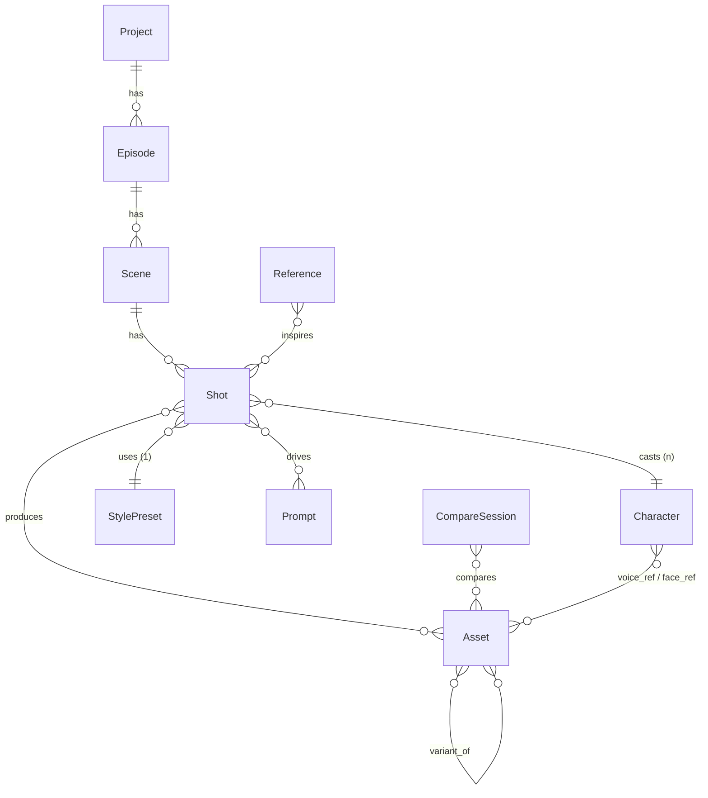

# soaviz studio v3 — Architecture & Data Model Spec

**For**: 상위 1% AI 영화 제작자 / 크리에이터
**By**: 은교 × Anthropic-style senior review
**Date**: 2026-04-24
**Status**: Draft for review

---

## 0. North Star

> **"AI 영화 제작 OS"** — 도구 모음(tool collection)에서 제작 운영체제(production OS)로.
> 한 줄 아이디어가 → 캐릭터 시트 → 스토리보드 → 모델 비교 생성 → 편집본까지 **끊김 없이** 흐른다.

### 5가지 설계 원칙
1. **Pipeline first.** 모든 객체는 Episode → Scene → Shot 트리에 위치를 가진다.
2. **Memory in, never out.** 한 번 만든 캐릭터·스타일·프롬프트는 다음 생성에 자동 주입된다.
3. **Compare by default.** 단일 결과물이 아니라 후보군. 선택과 비교가 1급 시민.
4. **Reference is currency.** 영감 → 프롬프트 변환을 시스템이 한다.
5. **Local-first, sync-ready.** IndexedDB 기반, 추후 협업 동기화 가능 구조.

### 비-목표 (out of scope, v3)
- 실시간 멀티플레이 협업 (v4)
- 모바일 앱 네이티브 (v4)
- 실제 NLE 편집 타임라인 (v4 — Premiere/DaVinci 연동으로 대체)

---

## 1. Information Architecture (IA)

### 1.1 사이드바 (개정안)

```
MAIN
  Today               (현재 유지)
  Pipeline            ← NEW · Episode/Scene/Shot 트리
  Library             (현재 유지, 확장)

CREATE
  Personas            (세계관/스토리텔링/대본 — 유지)
  Voice Studio
  Music Studio
  SFX Studio
  Video Studio
  Compare Mode        ← NEW · A/B/C 패널

REFERENCE                ← NEW SECTION
  Character Bible     ← NEW
  Style Bible         ← NEW
  Cinema Library      ← NEW

MEMORY
  Prompts             (유지)
  Activities          (유지)
  Versions            ← NEW · 버전 트리

SYSTEM
  Settings
```

### 1.2 신규 페이지 5개

| 페이지 | 1줄 정의 | 핵심 객체 |
|---|---|---|
| **Pipeline** | 시리즈를 Episode → Scene → Shot 트리로 본다 | Episode, Scene, Shot |
| **Character Bible** | 캐릭터 시트(얼굴·보이스·성격) 카드 | Character |
| **Style Bible** | 룩북(컬러·카메라·라이팅) 카드 | StylePreset |
| **Cinema Library** | 참고 영상 임베드 + 타임코드 메모 | Reference, RefClip |
| **Compare Mode** | 같은 프롬프트 N개 모델 동시 생성 비교 | CompareSession |

### 1.3 객체 관계도 (mermaid)



---

## 2. Data Model (TypeScript 시그니처)

> 모든 객체는 `id`, `createdAt`, `updatedAt`, `projectId` 공통 필드.
> 저장: IndexedDB (Dexie.js) — localStorage에서 점진 마이그레이션.

### 2.1 공통 타입

```ts
type ID = string;            // ULID 권장 (시간 정렬)
type ISODate = string;       // 2026-04-24
type Timestamp = number;     // Date.now()
type Uri = string;           // blob: | https: | file:

interface Base {
  id: ID;
  projectId: ID;
  createdAt: Timestamp;
  updatedAt: Timestamp;
  archived?: boolean;
  tags?: string[];
}

type Status = 'draft' | 'generated' | 'approved' | 'final' | 'failed' | 'archived';
```

### 2.2 Module 1 — Storyboard Pipeline

```ts
interface Project extends Base {
  title: string;
  logline: string;          // 1줄 컨셉
  genre: string[];
  format: 'short' | 'series' | 'film' | 'mv' | 'ad';
  targetRuntime?: number;   // 분
  deadline?: ISODate;       // 기존 goal과 1:1 매핑
  color: string;
  coverAssetId?: ID;
}

interface Episode extends Base {
  parentId: ID;             // Project
  number: number;           // E01
  title: string;
  synopsis: string;
  targetDuration: number;   // 초
  status: Status;
}

interface Scene extends Base {
  parentId: ID;             // Episode
  number: number;           // S03
  heading: string;          // INT. 우주선 — 새벽
  beat: string;             // 1줄 의도 ("주인공 각성")
  characterIds: ID[];
  styleId?: ID;             // StylePreset
  status: Status;
}

interface Shot extends Base {
  parentId: ID;             // Scene
  number: number;           // 03
  type: 'wide' | 'medium' | 'cu' | 'ecu' | 'pov' | 'insert' | 'establish';
  cameraMove?: 'static' | 'pan' | 'tilt' | 'dolly' | 'crane' | 'handheld' | 'drone';
  durationSec: number;
  description: string;      // 1줄 액션 ("그녀가 천천히 눈을 뜬다")
  dialogue?: string;        // 대사 (있으면)
  characterIds: ID[];
  styleId?: ID;             // 씬 스타일을 오버라이드
  promptId?: ID;            // 가장 최근 채택 프롬프트
  approvedAssetId?: ID;     // 최종 채택 결과물
  candidateAssetIds: ID[];  // 후보 결과물 (Compare Mode 결과)
  notes: string;
  status: Status;
}
```

### 2.3 Module 2 — Character & Style Bible

```ts
interface Character extends Base {
  name: string;
  role: 'protagonist' | 'antagonist' | 'supporting' | 'extra';
  age?: number;
  gender?: string;
  appearance: string;            // 외형 묘사 (프롬프트 자동 주입용)
  personality: string;
  faceRefAssetIds: ID[];         // 참조 이미지 1~N
  voiceId?: string;              // ElevenLabs voice id
  voiceSampleAssetId?: ID;
  ttsSettings?: {
    stability: number; similarity: number; style: number;
  };
  promptFragment: string;        // 생성 시 자동 prepend되는 텍스트
}

interface StylePreset extends Base {
  name: string;
  scope: 'project' | 'scene' | 'shot';
  // Visual
  palette: string[];             // hex 배열
  lightingMood: 'natural' | 'dramatic' | 'soft' | 'noir' | 'high-key' | 'low-key';
  cameraStyle: string;           // "anamorphic 2.39:1, 35mm film grain"
  colorGradeRef?: ID;            // Asset
  // Audio
  scoreMood?: string;            // "ambient drone with cello"
  sfxDensity?: 'sparse' | 'normal' | 'dense';
  // 자동 주입
  promptFragment: string;        // "shot on Arri Alexa, golden hour, ..."
  negativePromptFragment?: string;
  // Reference
  referenceAssetIds: ID[];
}
```

### 2.4 Module 3 — Compare Mode

```ts
interface CompareSession extends Base {
  shotId?: ID;                   // Shot에 묶이면 결과 채택 가능
  promptId: ID;                  // 같은 prompt
  models: string[];              // ["veo-4", "kling-3.0-master", "seedance-2-pro"]
  candidates: CompareCandidate[];
  winnerAssetId?: ID;            // 채택
  status: 'queued' | 'running' | 'done' | 'partial' | 'failed';
}

interface CompareCandidate {
  model: string;
  assetId?: ID;                  // 생성 완료 시 부여
  status: Status;
  metrics: {
    genTimeMs?: number;
    cost?: number;               // 추정 USD
    userScore?: number;          // 1~5
  };
  errorMessage?: string;
}
```

### 2.5 Module 4 — Cinema Library

```ts
interface Reference extends Base {
  title: string;
  source: 'youtube' | 'vimeo' | 'upload' | 'url';
  url: string;
  thumbnailUrl?: string;
  director?: string;
  year?: number;
  genre?: string[];
  notes: string;                 // 왜 인상 깊었는지
  promptDerived?: string;        // GPT가 추출한 프롬프트
}

interface RefClip extends Base {
  parentId: ID;                  // Reference
  startSec: number;
  endSec: number;
  label: string;                 // "오프닝 카메라 워크"
  category: 'composition' | 'lighting' | 'color' | 'camera' | 'pace' | 'sound' | 'transition';
  derivedStyleId?: ID;           // 이 클립을 StylePreset으로 변환했다면
  attachedShotIds: ID[];         // 어떤 샷에 영감을 줬는가
}
```

### 2.6 확장: Asset / Prompt (기존 보강)

```ts
interface Asset extends Base {
  type: 'voice' | 'music' | 'tts' | 'sfx' | 'video' | 'image' | 'frame';
  title: string;
  url?: Uri;
  blobKey?: string;              // IndexedDB blob ref
  duration?: number;
  resolution?: { w: number; h: number };
  model?: string;
  promptId?: ID;
  shotId?: ID;                   // ★ 새 필드: 어떤 샷에 속하는가
  parentAssetId?: ID;            // variant_of
  status: Status;
}

interface Prompt extends Base {
  promptType: 'tts' | 'music' | 'sfx' | 'video' | 'image' | 'world' | 'story';
  text: string;
  negativeText?: string;
  shotId?: ID;                   // ★ 새 필드
  characterIds?: ID[];           // ★ 자동 prepend된 캐릭터
  styleId?: ID;                  // ★ 자동 prepend된 스타일
  resolvedText: string;          // ★ 캐릭터·스타일 fragment 합쳐진 최종 텍스트
  status: Status;
  parentPromptId?: ID;
}
```

---

## 3. Module 별 UX 플로우

### 3.1 Pipeline (스토리보드)

**진입**: 사이드바 Pipeline → 좌측 트리, 우측 디테일

**핵심 인터랙션**
1. 트리에서 Episode 선택 → 우측에 Scene 카드 그리드
2. Scene 클릭 → Shot 카드 그리드 (썸네일 + 캐릭터 chip + 상태)
3. Shot 카드 클릭 → 디테일 패널 (프롬프트 / Compare 결과 / 채택 / 노트)
4. Shot에서 [Generate] → Compare Session 자동 생성 (기본 3개 모델)

**자동화**
- Personas의 "스토리텔링" 결과물을 자동 파싱해 Episode/Scene 초안 생성
- 각 Scene heading에서 카메라 키워드 추출 → Shot type 추천

### 3.2 Character Bible

**진입**: REFERENCE → Character Bible

**핵심 인터랙션**
1. + Character → 모달 (이름 / 역할 / 외형 / 보이스 ID)
2. 얼굴 ref 이미지 드래그 업로드
3. 보이스 샘플 녹음 또는 ElevenLabs voice 검색 → 선택
4. [Test] → 입력 텍스트로 즉시 보이스 미리듣기
5. 카드의 ⋮ → "이 캐릭터가 등장하는 샷 보기" → Pipeline 필터링

**자동 주입**
- Shot의 characterIds에 Character가 있으면, 생성 시 `character.promptFragment`를 prompt 앞에 자동 prepend → `resolvedText` 생성

### 3.3 Style Bible

**진입**: REFERENCE → Style Bible

**핵심 인터랙션**
1. + Style → 팔레트 픽커 (eyedropper / hex 입력 / 이미지에서 추출)
2. 카메라/라이팅 드롭다운 → promptFragment 자동 생성
3. [Apply to Project / Episode / Scene] 버튼 → 일괄 적용

**자동화**
- 참조 이미지 1장 업로드 → GPT-4 Vision으로 팔레트·무드·카메라 자동 추출

### 3.4 Compare Mode

**진입**: CREATE → Compare Mode (또는 Shot 디테일에서 [Generate] 클릭)

**UI**: 가로 3분할 패널, 각 패널 = 1 모델

**플로우**
1. 프롬프트 입력 → 모델 N개 체크 (기본 3)
2. [Run] → 병렬 polling → 각 패널에 결과 표시
3. 비교 후 [Pick winner] → Shot의 approvedAssetId 업데이트
4. [Save losers as candidates] → 후보로 보관 (Variants 트리)

**메트릭 표시**
- 생성 시간 / 추정 비용 / 사용자 점수 슬라이더 (1~5)

### 3.5 Cinema Library

**진입**: REFERENCE → Cinema Library

**핵심 인터랙션**
1. + Reference → URL 붙여넣기 (YouTube/Vimeo) 또는 업로드
2. 임베드된 플레이어에서 타임코드 마킹 → RefClip 생성
3. 각 RefClip에 카테고리 태그 (composition / lighting / ...)
4. [Convert to Style] → GPT가 클립 분석 → StylePreset 초안 생성
5. RefClip을 Shot에 드래그 → "이 샷의 영감" 연결

---

## 4. Cross-cutting 결정사항

### 4.1 저장 전략 — IndexedDB 마이그레이션

| 단계 | 데이터 | 위치 |
|---|---|---|
| v2 (현재) | 모든 데이터 | localStorage (5MB 한계 임박) |
| v3.0 | 메타데이터 | localStorage (조회 빠름) |
| v3.0 | Blob (음원·영상) | IndexedDB (`soaviz-blobs` 스토어) |
| v3.5 | 모든 데이터 | IndexedDB (Dexie.js) — schema versioning |

**마이그레이션**: 1회용 스크립트 `migrateToIDB()` 첫 진입 시 자동 실행, 진행률 표시.

### 4.2 자동 주입 (prompt resolution)

```ts
function resolvePrompt(p: Prompt, shot: Shot): string {
  const chars = shot.characterIds.map(getChar);
  const style = getStyle(shot.styleId ?? shot.scene.styleId ?? shot.scene.episode.project.defaultStyleId);
  const fragments = [
    style?.promptFragment,
    ...chars.map(c => c.promptFragment),
    p.text,
  ].filter(Boolean);
  return fragments.join('. ');
}
```

매 생성 직전 호출 → `prompt.resolvedText` 저장 → 재현성 보장.

### 4.3 버전 트리

모든 변경은 **불변(immutable)**. 수정 = 새 버전 생성 + `parentId` 링크.
`Versions` 페이지에서 트리 시각화 (D3 또는 단순 indented list).

### 4.4 단축키 (시니어 크리에이터 기대)

| Key | 동작 |
|---|---|
| `⌘P` | 빠른 점프 (Episode/Scene/Shot/Character) |
| `⌘G` | 현재 Shot에 Generate (Compare 시작) |
| `⌘D` | 선택 Shot 복제 |
| `⌘\` | 사이드바 토글 |
| `J / K` | 트리 위/아래 |
| `Space` | 미니플레이어 재생/정지 |

### 4.5 메모리·시그니처 통합

기존 Today 페이지의 5개 시그니처(Continue / Next 3 / Health / Stuck / Quick Resume)는 **Pipeline 데이터를 인지**하도록 확장:
- Stuck Points → "Scene S04에 Shot이 없음" 검출
- Next 3 Tasks → "오늘 할 Shot 3개" 추천
- Production Health → 채택률 / 페이스 / 캐릭터 일관성 점수 추가

---

## 5. 구현 로드맵 (8주)

### M0 — Foundation (Week 1)
- [ ] IndexedDB 도입 (Dexie) + blob 마이그레이션 스크립트
- [ ] 공통 Base 타입 + ID 생성기 (ULID)
- [ ] resolvePrompt() 골격
- **Acceptance**: 기존 자산 그대로 보임, 새 파이프라인은 IDB

### M1 — Pipeline MVP (Week 2~3)
- [ ] Project / Episode / Scene / Shot 스키마 + CRUD
- [ ] 좌 트리 + 우 디테일 레이아웃
- [ ] Personas 결과 → Episode 자동 분해 파서
- [ ] Shot 카드 그리드 + 드래그로 순서 변경
- **Acceptance**: 시리즈 1개를 트리에서 끝까지 만들 수 있음

### M2 — Character & Style Bible (Week 4)
- [ ] Character / StylePreset CRUD
- [ ] 팔레트 픽커 + 이미지 → 팔레트 추출
- [ ] resolvePrompt() 자동 주입 활성화
- [ ] Shot 디테일에 캐릭터·스타일 chip 표시
- **Acceptance**: Shot에 Character 추가 → 다음 generate 프롬프트에 fragment 반영

### M3 — Compare Mode (Week 5~6)
- [ ] CompareSession 스키마 + 병렬 polling
- [ ] 3분할 UI + 메트릭 표시
- [ ] Pick winner / Save losers
- [ ] Shot 디테일과 양방향 연동
- **Acceptance**: 한 프롬프트로 3개 모델 동시 결과 → 채택까지

### M4 — Cinema Library (Week 7)
- [ ] Reference / RefClip CRUD
- [ ] YouTube/Vimeo 임베드 + 타임코드 마킹 UI
- [ ] GPT-4o Vision: 클립 → StylePreset 변환
- [ ] Shot에 RefClip 드래그 연결
- **Acceptance**: 영화 1편을 5개 클립으로 마킹 + 1개 클립 → Style 변환

### M5 — Performance Pass (Week 8)
- [ ] HTML 단일파일 → 모듈 분할 (Vite)
- [ ] 라우터 분리 + 레이지 로딩
- [ ] Lighthouse 90+ (LCP / CLS / TBT)
- [ ] 1000개 Shot 트리 60fps 보장 (가상 스크롤)
- **Acceptance**: 빌드 결과 < 500KB initial chunk

---

## 6. 리스크 레지스터

| 리스크 | 가능성 | 영향 | 대응 |
|---|---|---|---|
| Compare Mode가 비용 폭증 (3모델 × N샷) | 高 | 高 | 세션당 추정 USD 사전 표시 + 일일 한도 설정 |
| IndexedDB 브라우저 호환성 (Safari quota) | 中 | 中 | 50MB 임계 도달 시 사용자에 알림 + export 권장 |
| 단일 HTML → 모듈 분할 시 라우팅 깨짐 | 高 | 中 | M5 시작 전 e2e 회귀 테스트 100건 작성 |
| 캐릭터 일관성 (얼굴) — 모델별 격차 큼 | 高 | 高 | v3에서는 "참조"만, "강제"는 v4 (LoRA 도입) |
| 협업 부재로 팀 플레이어가 못 씀 | 中 | 中 | v3에서는 export/import (.soavizproj) 우선 지원 |

---

## 7. Open Questions — Resolved

각 항목에 시니어 추천안과 근거. 결정의 자세한 트레이드오프는 §9 Decision Log 참고.

| # | 질문 | **결정** | 근거 1줄 |
|---|---|---|---|
| Q1 | 편집 타임라인 v3 범위 | **Pipeline + 경량 Preview Timeline** | NLE는 못 이김, 리듬 확인은 필수 |
| Q2 | API 키 BYOK vs 프록시 | **BYOK 유지** + Encrypted Local Vault | 시니어는 본인 키, 백엔드 부담 X |
| Q3 | Export 포맷 | **`.soavizproj` + DaVinci XML + EDL** | Premiere XML 호환성 약함, DaVinci가 시니어 표준 |
| Q4 | AI Vision 제공자 | **Claude(스타일·시각) + GPT-4o(구조화) 듀얼** | 강점이 다름, vendor lock 회피 |
| Q5 | 버전 트리 깊이 | **소프트 100 + Cold Tier 압축** | "유지되는 것처럼 보임" UX, IDB 폭발 방지 |

---

## 8. 다음 액션

✅ 본 설계서 검토
✅ Open Questions 5개 결정 (§9)
⬜ M0 (Foundation) 착수 — IndexedDB + Dexie + ULID

---

## 9. Decision Log

> 각 결정은 **추천안 / 이유 / 트레이드오프 / 재검토 트리거**로 기록.
> 추후 빌드하다 다른 선택을 하게 되면 이 로그를 업데이트하고 변경 사유를 남긴다.

### D1 — 편집 타임라인 v3 범위

**결정**: Pipeline + **경량 Preview Timeline**. NLE 풀 편집은 v4로 위임.

**Preview Timeline의 정의**
- Shot.approvedAssetId를 시간순으로 정렬한 단일 트랙
- 재생/일시정지, 클립 트림(시작/끝 컷만), 클립 순서 드래그
- 배경음 1트랙 (글로벌 BGM) + 나레이션 1트랙
- 출력: 시퀀스 미리듣기 (브라우저에서 재생만, 렌더 X)

**근거**
- 스토리보드만 보면 "리듬"이 안 보임. 시니어 크리에이터는 5초 안에 페이스를 판단함.
- 렌더링/효과는 Premiere/DaVinci가 압도적. 우리가 그걸 따라잡을 수 없음.
- 60% 가치 / 20% 비용 — 가장 좋은 ROI.

**트레이드오프**
- ❌ 트랜지션·이펙트·자막 없음 (NLE에서 함)
- ❌ 4K 실시간 미리보기 못 함 (proxy 1080p로 한정)
- ✅ 채택본을 그대로 시간순으로 재생 → 페이스 검증 가능

**재검토 트리거**
- 사용자 50%+가 "Premiere로 export 안 하고 여기서 끝내고 싶다" 피드백
- WebCodecs API 안정화로 브라우저 렌더가 가능해질 때 (예상: 2026 Q4)

---

### D2 — API 키 전략 (BYOK vs 프록시)

**결정**: **BYOK 유지 + Encrypted Local Vault**. 프록시는 v4에서 Pro Tier로.

**Encrypted Local Vault 정의**
- 키는 IndexedDB의 별도 스토어 `secrets`에 저장
- AES-GCM 암호화, 마스터 패스프레이즈 1회 입력 (세션 동안 메모리 보관)
- export 시 키는 절대 포함되지 않음 (`.soavizproj`에서 제외)
- 키 분실 시 복구 불가 → 명시적 경고 + 백업 권장 UI

**근거**
- 상위 1% 크리에이터는 이미 ElevenLabs/OpenAI 본인 키 보유 (Pro/Studio plan)
- 프록시 운영 = 백엔드 인프라 + 빌링 + 사기 방지 + 한도 관리 → 1인 개발 범위 초과
- 프라이버시: 본인 키는 본인 데이터로 학습되지 않는다는 명확한 보장
- 실패 모드가 명확함: 키 잘못 입력 → 본인 책임

**트레이드오프**
- ❌ 신규 사용자 진입 장벽 (3개 서비스에 가입해야 함)
- ❌ 무료 체험 제공 어려움
- ✅ 마진 0% 운영 가능 (수익 모델 부담 X)
- ✅ 엔터프라이즈 컴플라이언스 자연 충족

**재검토 트리거**
- MAU 1000 돌파 시 — 프록시 도입으로 신규 진입 낮추기 검토
- 어느 한 서비스가 BYOK 정책 변경 시 (예: Replicate B2B 전환)

---

### D3 — Export 포맷

**결정**: 3종 동시 지원
1. **`.soavizproj`** (zip) — 백업/이주 (모든 메타 + blob refs)
2. **DaVinci Resolve XML** — 편집 인계 표준
3. **EDL** (CMX 3600) — 최저 공통분모, 보험

**왜 Premiere XML을 뺐는가**
- Premiere의 Final Cut XML import는 마커·트랜지션 호환성 주기적 깨짐
- 2024년 이후 시니어 영화/광고 제작 표준은 DaVinci로 빠르게 이동
- DaVinci Resolve가 무료 + 컬러그레이딩 1티어 → 우리 사용자층과 정합

**`.soavizproj` 구조**
```
project.soavizproj (zip)
├── manifest.json          ← 버전, 생성일, 체크섬
├── data/
│   ├── project.json       ← Project + Episodes + Scenes + Shots
│   ├── characters.json
│   ├── styles.json
│   ├── prompts.json
│   ├── compares.json
│   └── refs.json
└── blobs/
    ├── {ulid}.mp4         ← 채택본만 기본, 옵션으로 전체
    ├── {ulid}.mp3
    └── ...
```

**근거**
- `.soavizproj`: 기기 간 이주, 협업자에게 통째로 전달
- DaVinci XML: 타임라인 + 마커 + 클립 ref 보존
- EDL: 어떤 NLE도 EDL은 읽음 (보험)

**트레이드오프**
- ❌ Frame.io 직접 연동 없음 (v4)
- ❌ 자막(SRT) export는 별도 (Phase 1엔 X)
- ✅ DaVinci 직거래로 시니어 워크플로우 그대로 인계

**재검토 트리거**
- DaVinci import 깨짐 사례 보고 5건+ → Premiere XML 추가 검토
- Frame.io 사용자 비율 높음 시 → REST API 연동

---

### D4 — AI Vision 제공자 전략

**결정**: **듀얼 제공자**. 기본값은 작업별로 분리, 사용자가 Settings에서 오버라이드 가능.

**작업별 기본값 매트릭스**

| 작업 | 기본 | 이유 |
|---|---|---|
| 클립/이미지 → 스타일 추출 (룩북) | **Claude** | 시각적 디테일 묘사·뉘앙스 우월 |
| 클립 → 캐릭터 외형 추출 | **Claude** | 동일 |
| 스토리 텍스트 → Episode/Scene 분해 | **GPT-4o** | 구조화·JSON 출력 안정성 |
| 이미지 OCR (대본 사진 등) | **GPT-4o** | OCR 정확도 약간 우위 |
| 콘티 스케치 → Shot 메타 | **Claude** | 의미 추론 우월 |
| 자동 태깅 (장르·무드) | **GPT-4o-mini** | 비용 효율 |

**구현**
```ts
interface VisionRequest {
  task: 'style' | 'character' | 'structure' | 'ocr' | 'shot' | 'tag';
  preferred?: 'claude' | 'gpt';   // user override
  // ...
}
function pickProvider(req): 'claude' | 'gpt' {
  if (req.preferred) return req.preferred;
  return TASK_DEFAULTS[req.task];
}
```

**근거**
- 단일 제공자 의존 = vendor lock + 강점 미활용
- 사용자가 "이건 Claude가 잘하더라" 발견할 수 있게 명시적 선택권 제공
- 비용 관리: 작업별로 다른 모델·가격 매핑 가능

**트레이드오프**
- ❌ 두 SDK 유지 부담 (작은 비용)
- ❌ 사용자가 두 키 세팅 필요 (Settings UX 명확화로 완화)
- ✅ 강점 결합 → 결과 품질 상한선 ↑
- ✅ 한쪽 장애 시 폴백 가능

**재검토 트리거**
- 한쪽 모델이 모든 작업에서 다른 쪽을 압도 (벤치마크 객관적 우위 6개월 지속)
- 신규 메이저 Vision 모델 등장 (예: Gemini 3 Vision)

---

### D5 — 버전 트리 깊이 제한

**결정**: **소프트 한도 100 + Cold Tier 자동 압축**.

**작동 방식**
1. **Hot tier (1~100)**: 모든 데이터 + blob 유지, 즉시 재생
2. **Cold tier (101+)**: 메타 + 썸네일만 유지, blob 삭제. UI에 "압축됨 · 복원" 표시
3. **복원**: 사용자가 "복원" 클릭 → 원본 prompt + model + seed로 재생성 (ID 고정으로 가능한 경우만)

**왜 무제한이 아닌가**
- 1샷 평균 10초 1080p mp4 ≈ 5MB. 100 variants × 5MB = 500MB. 한 프로젝트 50샷이면 25GB.
- IndexedDB Safari quota: 디바이스 저장공간의 ~1%. 256GB 맥북 = 2.5GB. 즉 1프로젝트로 IDB 터짐.
- "유지되는 것처럼 보이게 하되, 실제는 cold storage" — Figma·Notion이 동일 패턴.

**왜 50이 아닌 100인가**
- 시니어 크리에이터는 한 샷에 20~30 variants 만들기도 함 (각도·카메라·라이팅 별)
- 50은 너무 빡빡함 (체감), 100은 안정 한도
- 200+은 사용자가 "내가 다 안 본다" 자각

**Cold Tier에서 살리는 것**
- ULID, prompt text, model, seed (있으면), 썸네일 (1프레임), userScore
- "복원 가능" 플래그 (모델·seed 정보 기반 재현 가능 여부)

**트레이드오프**
- ❌ 100 넘으면 즉시 재생 못 함 (재생성 시간 대기)
- ❌ Replicate 가격 변동 시 복원 불가능 사례 발생
- ✅ IDB 안정 + UX는 무제한처럼 보임
- ✅ Export 시 Cold Tier 메타도 포함 → 다른 기기에서 복원 가능

**재검토 트리거**
- WebCodecs/OPFS로 50GB+ 저장 안정화될 때 → 한도 상향
- 사용자 80%가 100 미만에서 머무름 → 한도 유지

---

## 10. Decision Impact Matrix

각 결정이 5개 모듈 + 마이그레이션에 미치는 영향.

| 결정 | M0 | M1 Pipeline | M2 Bible | M3 Compare | M4 Cinema | M5 Perf |
|---|:-:|:-:|:-:|:-:|:-:|:-:|
| D1 Preview Timeline | — | ★ 영향 大 | — | ○ | — | ○ |
| D2 BYOK Vault | ★ 신규 모듈 | — | — | ○ | ○ | — |
| D3 Export 3종 | ○ | ★ 메인 출력 | — | — | — | ○ |
| D4 듀얼 Vision | ★ Provider 추상화 | — | ★ 자동 추출 | — | ★ 클립→Style | — |
| D5 Cold Tier | ★ IDB 스키마 | ○ | ○ | ★ 변형 폭발 처리 | ○ | ○ |

**범례**: ★ 핵심 영향 / ○ 부차 영향 / — 무영향

**의미**: M0 (Foundation)에 D2, D4, D5가 모두 영향 → M0 범위가 처음 생각보다 큼. **M0를 1.5주로 재추정**.

---

## 11. M0 — Foundation 상세 (재정의)

D2/D4/D5 영향을 반영한 M0 구체 작업.

### M0.1 — IndexedDB + Dexie (3일)
- [ ] Dexie 설치, 스키마 v1 정의 (Project, Asset, Prompt, Activity, Goal)
- [ ] localStorage → IDB 1회 마이그레이션 (`migrateV2toV3()`)
- [ ] Cold Tier 표식 필드 (`storageTier: 'hot' | 'cold'`)

### M0.2 — Secrets Vault (2일)
- [ ] AES-GCM 암호화 유틸 (Web Crypto API)
- [ ] 마스터 패스프레이즈 prompt UI (1회 + 세션 메모리)
- [ ] 키 저장 → ElevenLabs / OpenAI / Anthropic / Replicate
- [ ] Settings 페이지에 통합 + "백업 권장" 알림

### M0.3 — Vision Provider 추상화 (2일)
- [ ] `pickProvider(task)` + `TASK_DEFAULTS` 맵
- [ ] Claude / GPT 클라이언트 wrapper (동일 인터페이스)
- [ ] 폴백 로직 (한쪽 fail → 다른 쪽 시도)

### M0.4 — ULID + Base 타입 (1일)
- [ ] ULID 생성기
- [ ] Base 인터페이스 적용 + 기존 데이터 ID 보강 마이그레이션

### M0.5 — Cold Tier 정책 (2일)
- [ ] 100 초과 감지 + 압축 큐
- [ ] 썸네일 추출 (1 프레임, 비디오는 ffmpeg.wasm)
- [ ] "복원" UX + 재생성 트리거

**M0 총 1.5주 (10 영업일)** — 다음 모듈 시작 가능.

---

## 12. 재검토 약속

위 5개 결정 중 어느 하나라도 다음 신호가 보이면 **즉시 재검토**:

| 신호 | 어느 결정 |
|---|---|
| 사용자 5명 이상이 같은 불편 보고 | 해당 결정 모두 |
| Anthropic·OpenAI Vision 가격 50%+ 변동 | D4 |
| Safari IDB quota 정책 변경 | D5 |
| WebCodecs 안정화 | D1 |
| Frame.io API 무료화 | D3 |

---

*이 문서는 살아있는 사양이다. 빌드하면서 발견되는 모든 결정은 이 파일에 우선 반영한 뒤 코드를 친다.*
