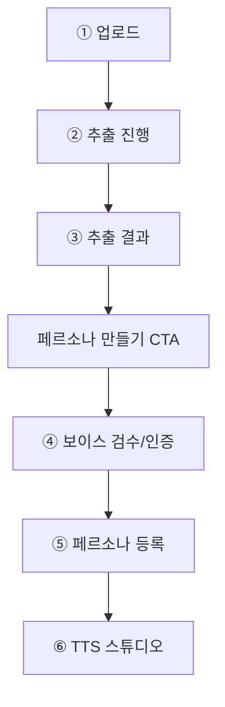

# 제품 플로우 초안

크리에이터가 음성을 추출하고, 그 결과를 바탕으로 페르소나를 만들고, 최종적으로 TTS 스튜디오까지 이어지는 핵심 사용자 흐름입니다.

## 핵심 플로우

```text
① 업로드
   -> ② 추출 진행
   -> ③ 추출 결과
         -> (페르소나 만들기 CTA)
         -> ④ 보이스 검수/인증
         -> ⑤ 페르소나 등록
         -> ⑥ TTS 스튜디오
```

## 단계별 의미

### 1. 업로드

- 사용자는 파일 업로드 또는 URL 입력으로 작업을 시작합니다.
- 이 단계에서는 파일 포맷, 용량, 저작권 고지, 보관 정책을 함께 안내합니다.

### 2. 추출 진행

- 백엔드에서 오디오 추출, 보컬 분리, 전사 등의 작업이 진행됩니다.
- 진행률과 상태 문구를 실시간으로 표시합니다.

### 3. 추출 결과

- `voice.wav` 와 필요 시 `srt`, `txt` 같은 결과물이 노출됩니다.
- 여기서 다운로드와 공유, 다음 단계 CTA를 제공합니다.
- 가장 중요한 전환 포인트는 `페르소나 만들기` 버튼입니다.

### 4. 보이스 검수/인증

- 사용자가 업로드한 음성과 실시간 녹음 음성을 비교합니다.
- 본인 음성 여부, 품질, 노이즈 상태, 화자 일관성을 검수합니다.
- 실패 시 재시도 또는 가이드 안내가 필요합니다.

주요 구성 요소:

- 파형 미리보기
- SNR 점수 표시
- 품질 상태 배지
- 랜덤 문장 녹음 버튼
- 본인 확인 결과 안내

추천 화면 와이어프레임:

```text
┌─────────────────────────────────────────┐
│  ← 뒤로                      [건너뛰기] │
├─────────────────────────────────────────┤
│                                         │
│       내 목소리, 맞는지 확인할게요       │
│   클론 생성 전에 2단계 검수를 거칩니다.  │
│                                         │
│   ─────────────────────────────────     │
│   1. 품질 점수                           │
│      음질     ●●●●○  Good               │
│      선명도   ●●●●●  Excellent          │
│      길이     1분 24초 (권장 30초↑)      │
│   ─────────────────────────────────     │
│   2. 본인 인증                           │
│                                         │
│   아래 문장을 15초 안에 녹음해 주세요.   │
│   ┌─────────────────────────────────┐   │
│   │ "사월의 바람은 창문을 지나        │   │
│   │  낯선 이름을 부른다."            │   │
│   └─────────────────────────────────┘   │
│                                         │
│            [ ● 녹음 시작 ]              │
│                                         │
│   이 문장은 매번 무작위로 바뀌어요.     │
│                                         │
├─────────────────────────────────────────┤
│   [ 다음: 페르소나 만들기 ]              │
└─────────────────────────────────────────┘
```

이 화면의 핵심 UX 포인트:

- 상단에서 `뒤로` 와 `건너뛰기`를 함께 제공
- 검수는 `품질 점수` 와 `본인 인증` 2단계로 분리
- 랜덤 문장은 한눈에 읽히는 카드 형태로 제공
- CTA는 항상 하단 고정으로 유지
- `이 문장은 매번 무작위로 바뀌어요` 문구로 대리 녹음 방지 의도를 자연스럽게 전달

완성형 카피:

| 요소 | 카피 |
|---|---|
| H1 | 내 목소리, 맞는지 확인할게요 |
| Sub | 클론 생성 전에 2단계 검수를 거칩니다 |
| 품질 섹션 제목 | 음성 품질 점수 |
| 품질 낮음 알림 | 노이즈가 많아요. 더 조용한 구간을 골라주세요. |
| 본인 인증 제목 | 본인 인증 |
| 지시 | 아래 문장을 15초 안에 녹음해 주세요 |
| 랜덤 문장 설명 | 이 문장은 매번 무작위로 바뀌어요. 녹음은 서버에 저장되지 않아요. |
| 성공 | 동일 화자로 확인됐어요 (일치도 94%) |
| 실패 | 다른 사람의 목소리로 보여요. 다시 녹음해 주세요. |

### 5. 페르소나 등록

- 인증을 통과한 음성을 기반으로 페르소나를 생성합니다.
- 이름, 설명, 톤, 용도 태그를 붙여 라이브러리에 저장합니다.

주요 구성 요소:

- 이름 입력
- 설명 입력
- 정체성/톤 요약
- 샘플 프리뷰 3종
  - 뉴스
  - 내레이션
  - 대화
- 저장 버튼

### 6. TTS 스튜디오

- 등록된 페르소나를 선택해 텍스트를 음성으로 생성합니다.
- 감정 태그, 강조, 쉼, 속도 조절 같은 편집 기능을 제공합니다.

주요 구성 요소:

- 텍스트 에디터
- 감정 슬라이더
- 속도 조절
- 피치 조절
- 생성 버튼
- 생성 히스토리

## 제품 관점 핵심 포인트

- `③ 추출 결과`는 단순 다운로드 화면이 아니라 전환 허브입니다.
- 여기서 사용자는 다음 중 하나를 선택합니다.
  - 파일만 받고 종료
  - 자막 생성으로 이동
  - 페르소나 생성으로 이동
- 따라서 결과 화면은 다운로드보다 `다음 액션` 설계가 중요합니다.

## 추천 UI 구조

### A. 추출 탭

- 업로드
- 진행 상태
- 결과 다운로드
- `페르소나 만들기` CTA

### B. 인증 탭

- 음성 샘플 확인
- 파형 및 SNR 점수
- 랜덤 문장 낭독
- 화자 비교 결과
- 통과 여부 안내

### C. 페르소나 탭

- 이름 입력
- 톤 설명
- 샘플 프리뷰 3종
- 저장

### D. TTS 스튜디오 탭

- 텍스트 입력
- 감정 슬라이더
- 속도·피치 제어
- 생성
- 다운로드
- 히스토리

## Mermaid 다이어그램



## 구현 우선순위

### Phase 1

- 업로드
- 추출 진행
- 추출 결과
- 결과 화면에서 `페르소나 만들기` CTA 연결

### Phase 2

- 보이스 검수/인증
- 페르소나 등록

### Phase 3

- TTS 스튜디오 정교화
- 감정 태그
- 워터마킹 및 정책 대응
